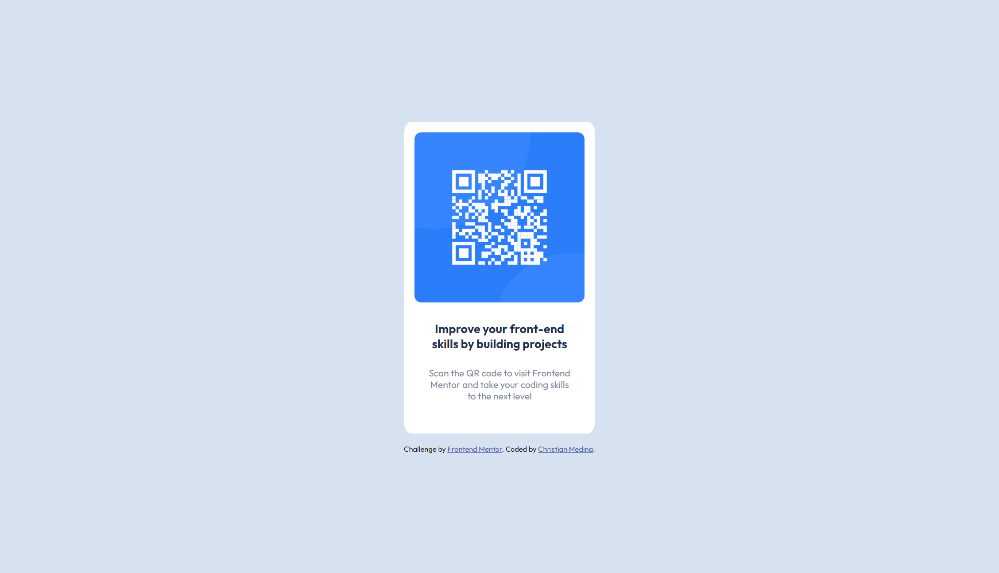

# Frontend Mentor - QR code component solution

This is a solution to the [QR code component challenge on Frontend Mentor](https://www.frontendmentor.io/challenges/qr-code-component-iux_sIO_H). Frontend Mentor challenges help you improve your coding skills by building realistic projects.

## Table of contents

- [Overview](#overview)
  - [Screenshot](#screenshot)
  - [Links](#links)
- [My process](#my-process)
  - [Built with](#built-with)
  - [What I learned](#what-i-learned)
  - [Continued development](#continued-development)
  - [Useful resources](#useful-resources)
- [Author](#author)
- [Acknowledgments](#acknowledgments)

**Note: Delete this note and update the table of contents based on what sections you keep.**

## Overview

### Screenshot



### Links

- Solution URL: [Add solution URL here](https://your-solution-url.com)
- Live Site URL: [QR Code Component](https://cmedina-dev.github.io/QR-Code-Component/)

## My process

### Built with

- Semantic HTML5 markup
- Flexbox
- [TypeScript](https://www.typescriptlang.org/) - For injecting scss
- [Sass](https://sass-lang.com/) - For styles

### What I learned

In this project I learned how to utilize nesting and variables with SCSS:

```css
$LightGray: hsl(212, 45%, 89%);
$GrayishBlue: hsl(220, 15%, 55%);
$DarkBlue: hsl(218, 44%, 22%);
```

I also dove into Vite for the first time for bundling my code:

```ts
import { defineConfig } from 'vite';
import path from 'path';

export default defineConfig({
  root: '.',
  build: {
    outDir: path.resolve(__dirname, 'dist'),
  },
});
```

### Continued development

I plan to continue exploring the use of SCSS and TypeScript, and am particularly excited to utilize them in a full-stack environment.

I also hope to learn more about Vite and its usage in future projects.

### Useful resources

- [SASS Guide](https://sass-lang.com/guide/) - This guide is great at helping newcomers get up to speed on how to use SASS / SCSS for more control over styling.

## Author

- Website - [Christian Medina](https://www.github.com/cmedina-dev)
- Frontend Mentor - [@cmedina-dev](https://www.frontendmentor.io/profile/cmedina-dev)
- LinkedIn - [@cjmedina3](https://linkedin.com/in/cjmedina3)
